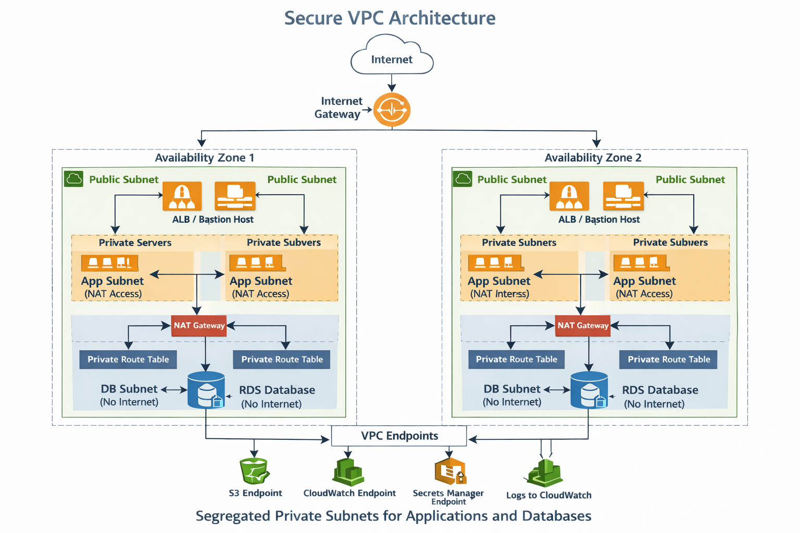

# Secure-VPC-architecture-with-Terraform
# Secure AWS VPC Architecture with Terraform

This project provisions a **production-grade AWS VPC architecture** using Terraform.

The infrastructure follows a **3-tier architecture**:

- Public Layer
- Application Layer
- Database Layer

The design ensures:

- High Availability
- Network Isolation
- Security
- Scalability

across **two Availability Zones**.

---

# Architecture Diagram

Below is the architecture diagram representing the infrastructure created by this Terraform project.

The architecture includes:

- VPC
- Internet Gateway
- 2 Availability Zones
- Public Subnets (ALB / Bastion)
- Private Application Subnets
- Private Database Subnets
- NAT Gateways
- Route Tables
- VPC Endpoints
- RDS Database

---

# Architecture Overview

The VPC spans **two Availability Zones** with **six subnets**.

Each Availability Zone contains:

- 1 Public Subnet
- 1 Private Application Subnet
- 1 Private Database Subnet
